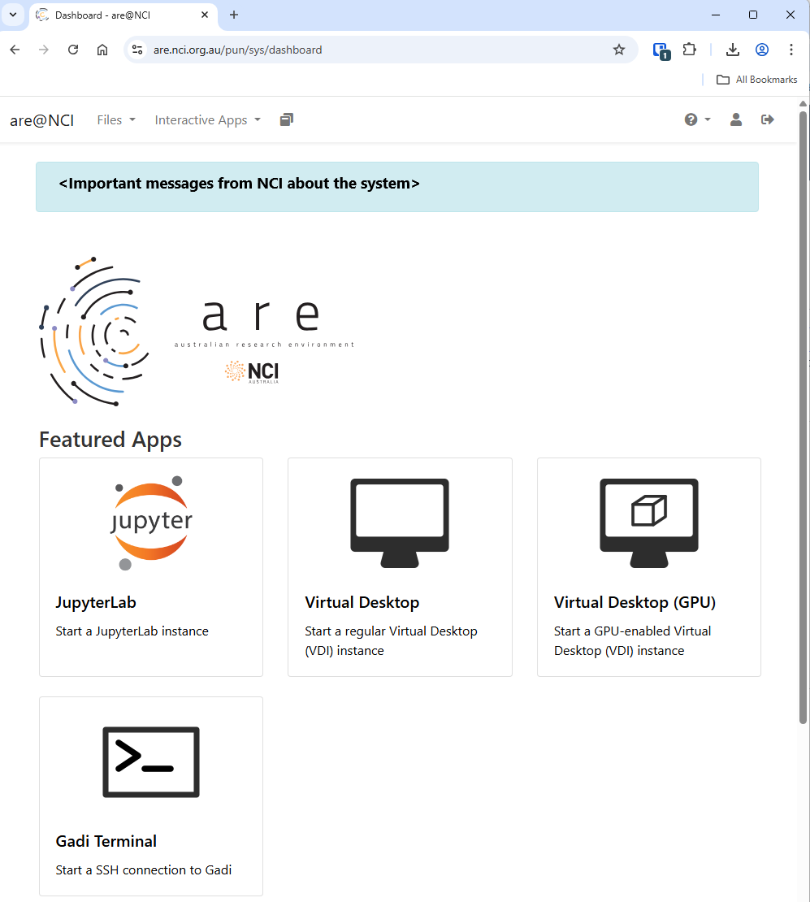
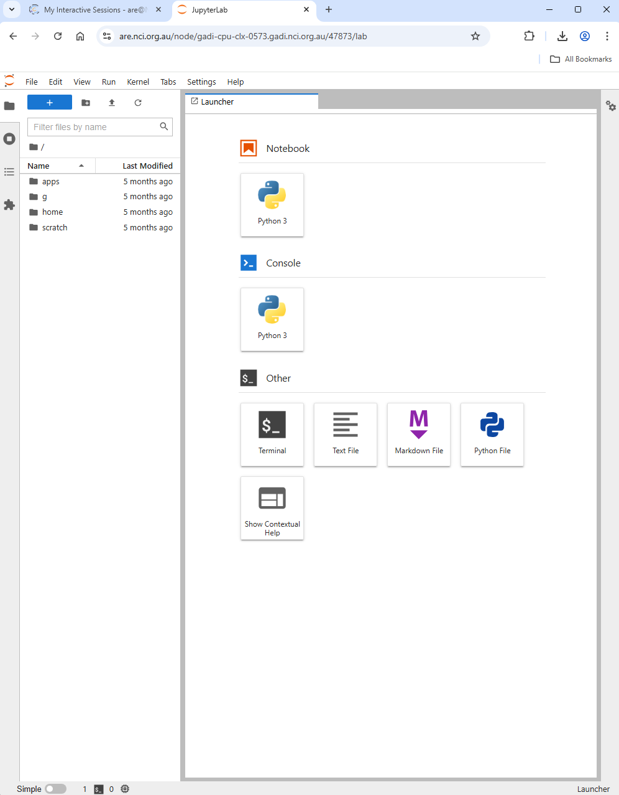

This lesson is designed for Software Carpentry users who have completed [Plotting and Programming in Python] and want to jump straight into image classification. We recognize this jump is quite large and have done our best to provide the content and code to perform these types of analyses.

The NCI-QCIF Training Partnership Project version of this lesson uses python virtual environments to run Jupyter Notebooks on [NCI's Gadi supercomputer].

It uses the [TensorFlow] software library in a **CPU** only environment.

::::::::::::::::::::::::::::::::::::::::: callout
Please note this lesson is designed to work with CPU only environments. This was an intentional decision to avoid the difficulties in setting up GPU environments. If you are an advanced user and choose to set up a GPU environment, you are on your own. We will not be able to troubleshoot any issues with GPU set up on the day of the workshop.
:::::::::::::::::::::::::::::::::::::::::::::::::

## NCI Account Setup

Sign up for an [NCI account] if you don't already have one.

Select **Projects and groups** from the left hand side menu and then select the **Find project or group** tab. Search for **cd82**, the NCI-QCIF Training Partnership Project, and ask to join.

  

## NCI Australian Research Environment (ARE)

Connect to [NCI Australian Research Environment].

Be sure you use your NCI ID (eg, ab1234) for the username and not your email address.

Under **Featured Apps**, find and click the **JupterLab: Start a JupyterLab instance** option.

  

To Launch a JuptyerLab session, set these resource requirements:

+---------------------------+------------------------------------------------+
| Resource                  | Value                                          |
+===========================+================================================+
| Walltime (hours)          | 5                                              |
| Queue                     | normal                                         |
| Compute Size              | small                                          |
| Project                   | cd82                                           |
| Storage                   | scratch/cd82                                   |
+---------------------------+------------------------------------------------+
| Advanced Options...       |                                                |
+===========================+================================================+
| Modules                   | python3/3.9.2                                  |
| Python or Conda virtual\  |                                                |
| environment base          | /scratch/cd82/venv_icwcnn                      |
+---------------------------+------------------------------------------------+

Then click the Launch button.

This will take you to your interactive session page you will see that that your JupyterLab session is Queued while ARE is searching for a compute node that will satisfy your requirements.

Once found, the page will update with a button that you can click to **Open JupyterLab**.

Here is a screenshot of a JupyterLab landing page that should be similar to the one that opens in your web browser after starting the JupyterLab server on either macOS or Windows.

  

## Getting the Data

This lesson uses the CIFAR-10 image dataset that comes prepackaged with Keras. There are no additional steps needed to access the data.

<!-- Collect your link references at the bottom of your document -->

[Plotting and Programming in Python]: https://swcarpentry.github.io/python-novice-gapminder/
[NCI's Gadi supercomputer]: https://nci.org.au/news-events/events/introduction-gadi-4
[TensorFlow]: https://www.tensorflow.org/
[NCI account]: https://my.nci.org.au
[NCI Australian Research Environment]: https://are.nci.org.au

